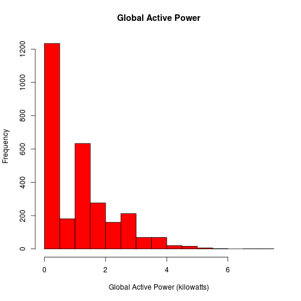

# See Project-1.R for required packages and to run program.
# See DataDownload_andProcessing.Rmd for all R processing steps.

# This file produces Plot 1 output

### Plot 1 save as PNG

```r
png(filename="./final_plot_pngs/plot1.png", width=480,height=480, bg='transparent')

# Create plot 1
histo <- hist(housedata$Global_active_power, breaks=12, main = "Global Active Power", col='red', xlab = "Global Active Power (kilowatts)")

dev.off()
```

```
## png 
##   2
```

### For HTML output

```r
histo <- hist(housedata$Global_active_power, breaks=12, main = "Global Active Power", col='red', xlab = "Global Active Power (kilowatts)")
```

 
