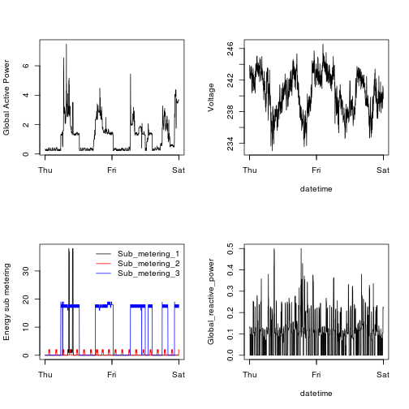

# See Project-1.R for required packages and to run program.
# See DataDownload_andProcessing.Rmd for all R processing steps.

# This file produces Plot 4 ouput

### Plot 4 save as PNG


```r
png(filename="./final_plot_pngs/plot4", width=480,height=480, bg='transparent')

par(mfrow=c(2,2))

plot(housedata$Date, housedata$Global_active_power, type="l", ylab="Global Active Power", xlab='')

plot(housedata$Date, housedata$Voltage, type="l", ylab="Voltage", xlab='datetime')

plot(housedata$Date, housedata$Sub_metering_1, type="l", ylab="Energy sub metering", xlab='')
lines(housedata$Date, housedata$Sub_metering_2, type="l", col="red")
lines(housedata$Date, housedata$Sub_metering_3, type="l", col="blue")
legend("topright", c('Sub_metering_1', 'Sub_metering_2', 'Sub_metering_3'), lty=c(1,1,1), col=c('black', 'red', 'blue'), bty="n")

plot(housedata$Date, housedata$Global_reactive_power, type="l", ylab="Global_reactive_power", xlab='datetime')

dev.off()
```

```
## png 
##   2
```

### Plot 4 for HTML output

```r
par(mfrow=c(2,2))

plot(housedata$Date, housedata$Global_active_power, type="l", ylab="Global Active Power", xlab='')

plot(housedata$Date, housedata$Voltage, type="l", ylab="Voltage", xlab='datetime')

plot(housedata$Date, housedata$Sub_metering_1, type="l", ylab="Energy sub metering", xlab='')
lines(housedata$Date, housedata$Sub_metering_2, type="l", col="red")
lines(housedata$Date, housedata$Sub_metering_3, type="l", col="blue")
legend("topright", c('Sub_metering_1', 'Sub_metering_2', 'Sub_metering_3'), lty=c(1,1,1), col=c('black', 'red', 'blue'), bty="n")

plot(housedata$Date, housedata$Global_reactive_power, type="l", ylab="Global_reactive_power", xlab='datetime')
```

 
